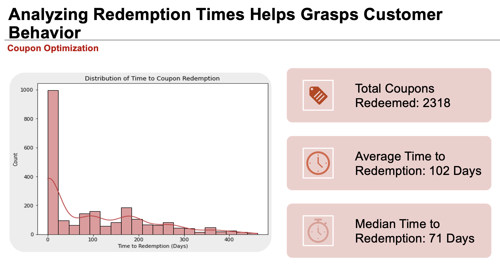
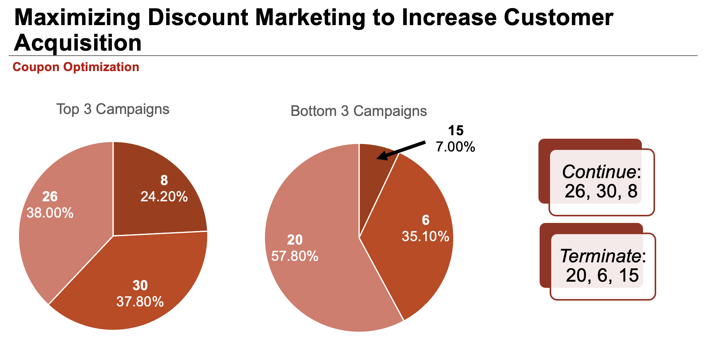
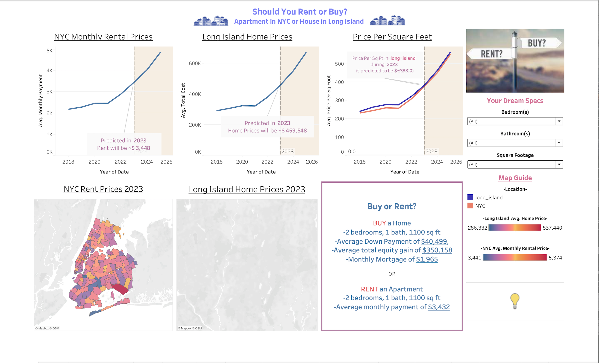
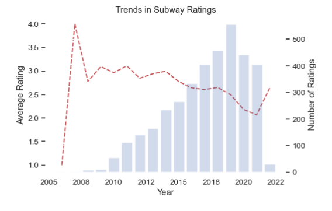
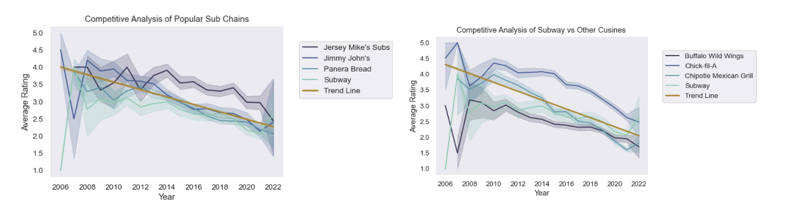
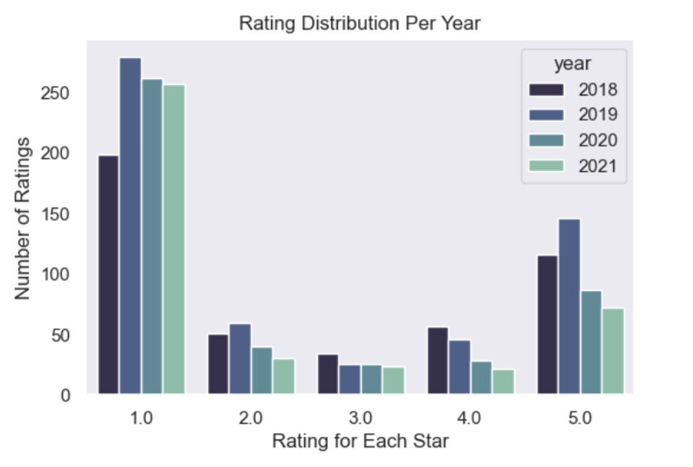
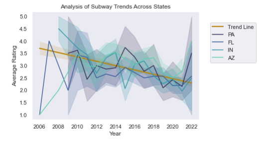
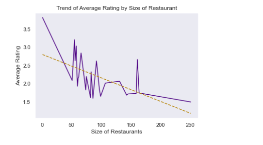

## My Links

  
  
  
  
  

## Education

### Cornell University (August 2023)
**M.S. Business Analytics, Supply Chain Operations Analytics**

<u>Relevant Courses:</u> Teamwork and Collaboration, Management Writing, Presentations with Data, Spreadsheet Modeling, Machine Learning  

<u>Extracurriculars:</u> Founding Member-Data Science Club, Editor- Yearbook 

### Saint Mary’s College of California (May 2020)
**B.S. Business Administration, Business Analytics**

<u>Leadership:</u> Vice President- Accounting Association

**B.S. Accounting**

<u>Leadership:</u> President- School of Economics and Business Administration Dean’s Advisory Board

## Work Experience

### Andersen LLC

**Tax Associate II- Private Client Services (Aug 2020- Aug 2022)**  
**Tax Intern – Private Client Services (Jun 2019-Sep 2019)**  

- Managed the tax aspects of a portfolio of high-income individuals with complex estate plans (15+ entities) including tax return preparation and forecasting of quarterly tax payments for business planning under tight deadlines.
- Mentored four interns (three received return offers).
- Chosen as an Intern to collaborate directly with the Director of US National Tax on a new tax research project.
- Selected as Intern Team Lead for National InternConnect, responsible for overseeing a team of 6 interns, ensuring seamless coordination and organization, attendee management, and logistical arrangements.

### Doris Forman CPA

**Tax Apprentice (Feb 2019-May 2020)** 

- Successfully managed a high volume of tax-related tasks during two busy tax seasons, demonstrating strong time management, organizational, and prioritization skills.
- Collaborated with team members to enhance efficiency and continued learning.

## Project Experience (Cornell)

[**Dunnhumby Retail Product Mix Optimization** ](https://github.com/Nisha-Ramasubramonian/Dunnhumby-Store-Analysis)

-	Explored the incremental impact of marketing offers on core success metrics and Key Performance Indicators (KPIs) and informed business decisions. 
-	Merged demographic data using SQL with coupon usage datasets to calculate and analyze repeat coupon usage and sales uplift by frequency, percentage, and campaign. 
-	Recommend and develop methodologies for measurement specific to marketing offers such as adjusting expiry dates, A/B testing, and boosting engagement to amplify coupon use and customer retention.  
-	Conducted Python and interpreted appropriate analyses to respond to business questions and communicated results and related findings to the marketing team by preparing presentations and identifying key takeaways such as top 3 and bottom 3 campaigns.
-	Directed and project-managed a team of five to collaborate with mentors, meet targets, navigate time zones, ensure effective communication, and review aesthetics and visual 
  legibility.

 
 

  
[**NYC Rent or Buy Interactive Dashboard** ](https://github.com/Nisha-Ramasubramonian/NYC-Rental-Interactive-Dash)

-	Utilized Python to consolidate and organize a multifaceted dataset within Excel, facilitating streamlined analysis to discern user preferences for buying or renting in NYC.
-	Integrated UX/UI principles by seamlessly incorporating Excel data into Tableau for dynamic visualization within the App. 
-	Led and project-managed a dynamic team of five members to successfully achieve target goals, fostering collaboration, effective communication, and brainstorming innovative 
  improvements and opportunities.

  

[**Subway Reviews** ](https://github.com/Nisha-Ramasubramonian/Subway-Reviews)

- Consulted with business strategy team to guide offers, strategies, and programs. Used data insight visualization techniques (such as bar charts and scatter plots) to support or disprove the following statements made by the Subway Restaurant Executives:
  - **Head of Customer Service:** “Our ratings are gradually improving, and we will soon reach 4.5/5.”
  - **Head of Store Operations:** “Sandwiches are a tricky business. All sandwich chains suffer from poor customer ratings.”
  - **Head of Social Media:** “The goal of 4.5/5 is unreasonable for national chains like us. Only small, local, and boutique restaurants can achieve such high ratings.”
  - **Chief Data Scientist:** “It is well known that customers make the effort to give a rating only when they are either extremely angry or absolutely delighted with the service. So online ratings are not reliable.”
-	Demonstrated the ability to take complex ideas and KPIs and Communicate results and related findings through Python (matplotlib, seaborn, scipy, and pandas)  to the Customer Service Team by preparing presentations using data visualizations (line charts, bar charts, scatterplots, groupedby dataframes, and linear regression) and identifying key takeaways of popularity and ratings. 
-	Consult with business strategies to guide offers strategies and programs using data and insights to determine the trajectory of 5-star reviews for sandwich shops by calculating average ratings and analyzing Subway rating trends across 50 states over ten years to determine popularity.
-	Organized 22 million records into data frames and merged them based on business criteria for efficient integration. This led the team to notice a downward trend, prompting the conclusion that reaching a 4.5/5 stars average was unreasonable.
-	Calculated average ratings and analyzed Subway rating trends across 50 states over ten years to determine popularity.

 
 
 
 
 
 

## Skills & Development

### Skills
<u>Technical Languages:</u> Python, Microsoft Office, Jupyter Notebook

<u>Native/Bi-Lingual:</u> English (Native Speaking and Writing), Tamil (Native Speaking)

<u>Soft Skills:</u> Proficient in quantitative, organizational, and analytical abilities; adept in fast-paced, team-oriented environments; skilled in ideation and continuous learning; proactive problem-solver; collaborative and adaptable

### Certifications

 

  
Boston Consulting Group Strategy Consulting

  

 

  
Accenture Data Analytics

  

 

  
Accenture Project Management

  

 

  
Goldman Sachs Excel for Business

  

 

  
Google Cloud Introduction to SQL for BigQuery and Cloud SQL

  

### Interests and Hobbies
Reading, Traveling, History, Dance, Anthropology
