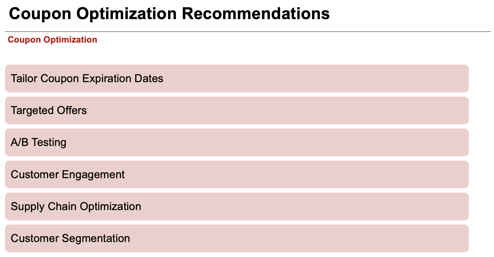
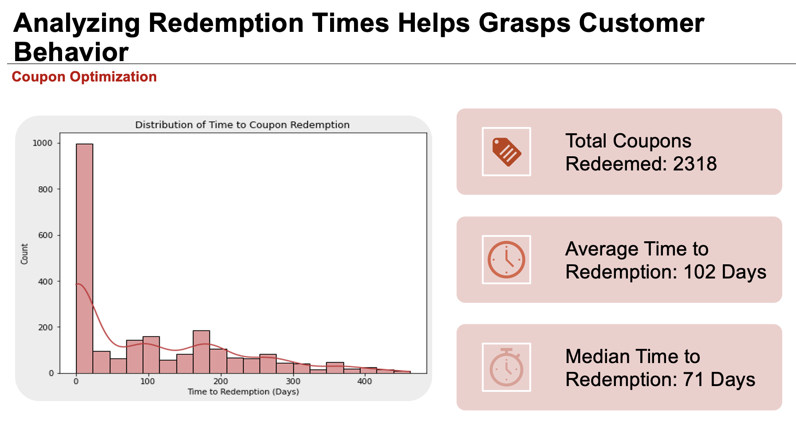
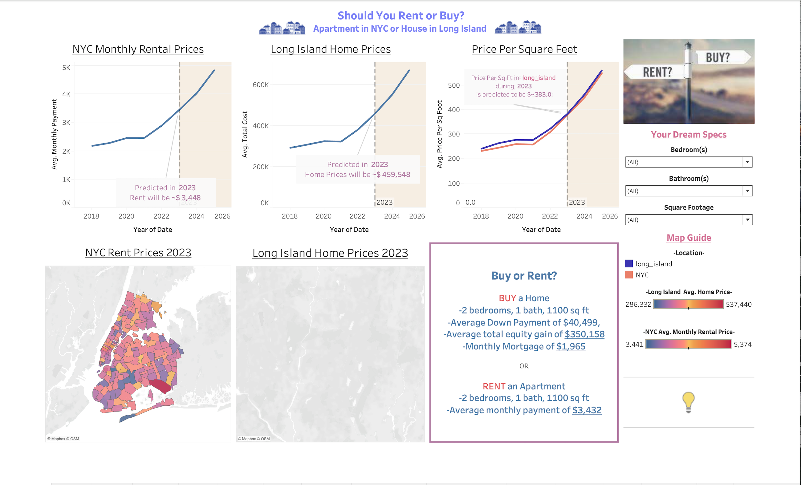
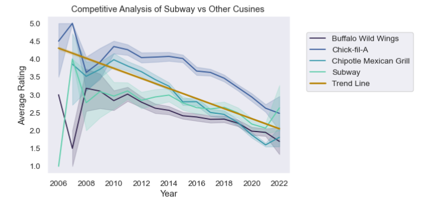

## Education

### M.S. Business Analytics, Supply Chain Operations Analytics | Cornell University (August 2023)

<u>Relevant Courses:</u> Teamwork and Collaboration, Management Writing, Presentations with Data, Spreadsheet Modeling, Machine Learning  

<u>Extracurriculars:</u> Founding Member-Data Science Club, Editor- Yearbook 

### B.S. Business Administration, Business Analytics | Saint Mary’s College of California (May 2020)

<u>Leadership:</u> Vice President- Accounting Association

### B.S. Accounting | Saint Mary’s College of California (May 2020)

<u>Leadership:</u> President- School of Economics and Business Administration Dean’s Advisory Board

## Work Experience

### Andersen LLC

**Tax Associate II- Private Client Services (Aug 2020- Aug 2022)**  
**Tax Intern – Private Client Services (Jun 2019-Sep 2019)**  

- Managed the tax aspects of a portfolio of high-income individuals with complex estate plans (15+ entities) including tax return preparation and forecasting of quarterly tax payments for business planning under tight deadlines.
- Mentored four interns (three received return offers).
- Assisted the National Tax Director on a tax law research project.
- Chosen as an Intern to collaborate directly with the Director of US National Tax on a new tax research project.
- Selected as Intern Team Lead for National InternConnect, responsible for overseeing a team of 6 interns, ensuring seamless coordination and organization, attendee management, and logistical arrangements.

### Doris Forman CPA

**Tax Apprentice (Feb 2019-Mar 2020)** 

- Successfully managed a high volume of tax-related tasks during two busy tax seasons, demonstrating strong time management, organizational, and prioritization skills.
- Collaborated with team members to enhance efficiency and continued learning.

## Projects

**Dunnhumby Retail Product Mix Optimization** 
[**Dunnhumby Retail Product Mix Optimization** ](https://github.com/Nisha-Ramasubramonian/Dunnhumby-Store-Analysis)

-	Explored the incremental impact of marketing offers on core success metrics and Key Performance Indicators (KPIs) and informed business decisions. 
-	Merged demographic data using SQL with coupon usage datasets to calculate and analyze repeat coupon usage and sales uplift by frequency, percentage, and campaign. 
-	Recommend and develop methodologies for measurement specific to marketing offers such as adjusting expiry dates, A/B testing, and boosting engagement to amplify coupon use and 
  customer retention.  
-	Conducted Python and interpreted appropriate analyses to respond to business questions and communicated results and related findings to the marketing team by preparing presentations and identifying key takeaways such as top 3 and bottom 3 campaigns.
-	Directed and project-managed a team of five to collaborate with mentors, meet targets, navigate time zones, ensure effective communication, and review aesthetics and visual 
  legibility.

  
 
  

**NYC Rent or Buy Interactive Dashboard**

-	Utilized Python to consolidate and organize a multifaceted dataset within Excel, facilitating streamlined analysis to discern user preferences for buying or renting in NYC.
-	Integrated UX/UI principles by seamlessly incorporating Excel data into Tableau for dynamic visualization within the App. 
-	Led and project-managed a dynamic team of five members to successfully achieve target goals, fostering collaboration, effective communication, and brainstorming innovative 
  improvements and opportunities.

  

**Subway Reviews**

-	Consulted with business strategies to guide offers strategies and programs using data insight visualization techniques (such as bar charts and scatter plots) with the Head of Customer Service for forecasting improvements.
-	Demonstrated the ability to take complex ideas and KPIs and Communicate results and related findings through Python to the Customer Service Team by preparing presentations using data visualized and identifying key takeaways of popularity and ratings. 
-	Consult with business strategies to guide offers strategies and programs using data and insights to determine the trajectory of 5-star reviews for sandwich shops by calculating average ratings and analyzing Subway rating trends across 50 states over ten years to determine popularity.
-	Organized 22 million records into data frames and merged them based on business criteria for efficient integration. This led the team to notice a downward trend, prompting the conclusion that reaching a 4.5/5 stars average was unreasonable.
-	Calculated average ratings and analyzed Subway rating trends across 50 states over ten years to determine popularity. 

 
 
 
 

## Skills & Development

### Skills
<u>Technical Languages: Python, Microsoft Office, Jupyter Notebook

<u>Native/Bi-Lingual: English (Native Speaking and Writing), Tamil (Native Speaking)

<u>Soft Skills: Proficient in quantitative, organizational, and analytical abilities; adept in fast-paced, team-oriented environments; skilled in ideation and continuous learning; proactive problem-solver; collaborative and adaptable

### Interests and Hobbies
Reading, Traveling, History, Dance, Anthropology

### Certifications
 
